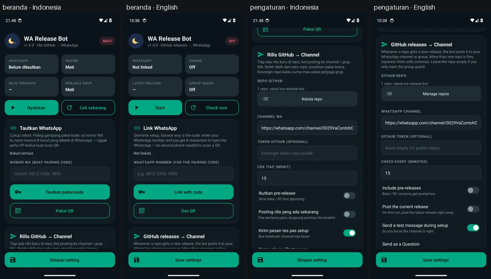

<div align="center">

# WA Release Bot

**Bot WhatsApp yang nggak nyala 24 jam. Dia tidur.**

Bangun tiap N menit → cek GitHub → ada release baru? posting ke channel WA → tidur lagi.
Nggak ada update? 0% CPU, 0% data.

[](https://github.com/xykal/wa-release-bot/actions/workflows/build-apk.yml)
[](https://github.com/xykal/wa-release-bot/actions/workflows/code-quality.yml)
[](https://github.com/xykal/wa-release-bot/actions/workflows/codeql.yml)
[](https://github.com/xykal/wa-release-bot/actions/workflows/security.yml)
[](https://securityscorecards.dev/viewer/?uri=github.com/xykal/wa-release-bot)

[](LICENSE)
[-3DDC84?logo=android&logoColor=white)](#pakai-setelah-install)
[](docs/ARCHITECTURE.md)

</div>

---

<details>
<summary><strong>English summary</strong></summary>

WA Release Bot watches one or more GitHub repositories and posts every new release to a
WhatsApp channel (or group) from your own phone, no server needed. It runs a real Node.js 18
engine inside an Android app (nodejs-mobile) and only connects to WhatsApp for the few
seconds it takes to post; between checks it sleeps. A CLI for Termux/PC shares the
exact same engine. Release checks use conditional requests (ETag), so an unchanged
repo costs 0 bytes and no API quota. Extras: group gatekeeper (auto-approve joins,
reject members who left), optional "mood song" voice notes, and hosting for your own
small Node.js bot. Source-available under a personal-use license; see LICENSE.
The app UI follows the phone language (Indonesian by default, English when the system
language is English); the bot's WhatsApp messages and the log are Indonesian only.
Built by xykal — XyVerse Technology Global.

</details>

Ada **dua cara** pakai bot ini:

| | [Aplikasi Android](#aplikasi-android--host-di-hp-sendiri) | [CLI (Termux / PC)](#cli--termux--pc) |
|---|---|---|
| Butuh Termux / PC | tidak | ya |
| Mulai otomatis setelah HP reboot | ya | ya (cron/termux-boot) |
| Cara instal | unduh APK dari [Releases](../../releases) | `git clone` + `npm install` (Node 20+) |
| Paling cocok buat | HP nganggur yang bisa dicharge terus | yang udah nyaman di terminal |

Keduanya pakai **engine bot yang sama** (`bot-js/`): CLI meng-import modul `bot-js/src` langsung
(npm workspaces), jadi fix di engine otomatis berlaku di CLI juga.

---

## Flow

```
   Service nyala (foreground service / cron)
             │
             ▼
   Engine bangun tiap N menit (default 15)
             │
             ▼
   Cek GitHub  ──  1 request API, ±1 detik
             │
      ┌──────┴───────┐
      ▼              ▼
   NGGAK ADA       ADA!
      │              │
      ▼              ▼
   TIDUR      WA nyambung 2–5 detik
   (0% CPU,     → posting ke channel
    0% data)    → WA dilepas → TIDUR lagi
```

> **HP harus tetap nyala.** HP yang di-*off* nggak bisa menjalankan aplikasi apa pun —
> itu batasan fisik, bukan batasan app ini. Charge terus, layar boleh mati.

---

## Fitur

- **Host di HP sendiri** — aplikasi Android native, tanpa Termux, tanpa VPS
- **Tidur-bangun beneran** — WhatsApp baru terhubung pas mau posting
- **Tautkan sekali seumur hidup** — pakai **pairing code** (8 huruf, tanpa HP kedua) atau QR
- **Penjaga grup** — auto-approve permintaan join, tolak yang dulu udah keluar/dikeluarin
- **Moderasi grup** — link phishing/promo/judi dihapus, peringatan, strike terakhir dikeluarkan; admin aman
- **Bot WA umum** — perintah pribadi di chat sendiri: `.menu`, `.ping`, `.status`, `.brat <teks>`, `.welcome on/off`, `.stiker`, `.story` (byte asli; kualitas akhir ditentukan WhatsApp); `.storygrup` menunggu dukungan native mention
- **Post ke channel WA** (tempel link channel-nya) — atau ke **grup WA** kalau lebih gampang
- **Bikin channel dari app** — belum punya channel? bot yang bikinin, sekali klik
- **Watchdog** — WorkManager + boot receiver: service ke-bunuh Android → nyala lagi
- **UI status real-time** — log, tag terakhir, hitungan mundur, dialog QR
- **Semua setting bisa diubah dari UI** — repo, interval, token, prerelease, dll.
- **Banyak repo sekaligus** — isi kolom repo pakai koma (`a/x, b/y`); tiap repo punya baseline sendiri
- **Notifikasi kalau gagal kirim** — percobaan ke-3 gagal → notifikasi Android + laporan ke chat diri sendiri
- **Zero secret di repo** — token cuma hidup di HP lo / GitHub Secrets

---

## Aplikasi Android — host di HP sendiri

### Instal

**Cara cepat** — unduh APK dari [**halaman unduh**](https://wabot.projectkal.my.id/unduh/)
(atau [Releases](../../releases)), pasang di HP (aktifkan *Install unknown apps*), lanjut ke
[Pakai Setelah Install](#pakai-setelah-install). Situs: <https://wabot.projectkal.my.id>.

**Build sendiri** — lihat [docs/BUILD.md](docs/BUILD.md).

### Pakai setelah install

1. Buka app → tab **Beranda** → kartu **Tautkan WhatsApp** → isi **nomor WA** lo →
   **Tautkan pakai kode**
2. Muncul kode 8 huruf. Di WhatsApp: **⋮ → Perangkat tertaut → Tautkan perangkat →
   Tautkan dengan nomor telepon saja** → ketik kodenya. (Biasanya WA juga ngirim
   notifikasi "masukkan kode" — tinggal tap.)
   Punya HP kedua? Boleh juga pakai **Pakai QR**.
3. Tab **Repo** → kartu **Rilis GitHub → Channel**: tekan **Kelola repo**, tambah repo
   (`owner/nama-repo` atau link GitHub; boleh banyak, tiap repo boleh punya channel khusus) →
   kembali, isi link channel utama (belum punya? tekan **Bikin channel**) → **Simpan setting**
4. Tab **Beranda** → tekan **Mulai**
5. Tab **Pengaturan** → kartu **Batre & nyala otomatis**: tekan dua tombolnya (izin batre +
   Autostart).
   Di Xiaomi ini **wajib**, kalau nggak bot dibunuh pas layar mati dan nggak
   nyala habis restart.

Layar utama dipecah lima tab lewat bar navigasi bawah (**Beranda, Repo, Fitur, Log,
Pengaturan**). Panduan lengkap tiap tab dan kartu (cara kerja, penjaga grup, batre, cara dapat
link channel, lagu mood, hosting bot custom): [docs/PANDUAN-APP.md](docs/PANDUAN-APP.md).
Fitur WhatsApp-nya (moderasi grup, perintah di chat sendiri, stiker, story, pesan berkala):
[docs/PANDUAN-BOT-WA.md](docs/PANDUAN-BOT-WA.md).

### Bahasa

UI app mengikuti bahasa HP: Indonesia (bawaan) atau Inggris. Tangkapan di bawah dari
emulator CI (workflow Screenshot app, input `bahasa`); pesan bot di WhatsApp dan isi log
tetap Indonesia.



---

## CLI — Termux / PC

```bash
# 1. Dependensi (Termux)
pkg update -y && pkg install -y nodejs git
# atau jalankan: bash cli/setup-termux.sh

# 2. Ambil kode + install (npm install di ROOT repo, bukan di cli/ —
#    CLI memakai engine yang sama dengan APK dari bot-js/, dependensinya
#    dipasang sekali lewat npm workspaces; butuh Node 20+)
git clone https://github.com/xykal/wa-release-bot.git
cd wa-release-bot
npm install --ignore-scripts
cd cli

# 3. Konfigurasi
cp config.example.json config.json
nano config.json

# 4. Tautkan WA sekali seumur hidup — pakai pairing code (satu HP cukup):
npm run setup -- --pair 081234567890
#    ...atau scan QR dari HP lain:  npm run setup

# 5. Jadwalkan (ini yang bikin bot "nggak nyala 24 jam")
crontab -e
```

Baris cron — bangun tiap 15 menit, posting kalau ada release baru, langsung mati lagi:

```cron
*/15 * * * * cd ~/wa-release-bot/cli && /data/data/com.termux/files/usr/bin/node src/bot.mjs --once >> bot.log 2>&1
```

| Perintah | Fungsi |
|---|---|
| `npm run setup -- --pair 08xxxx` | Tautkan pakai pairing code + catat channel + baseline release |
| `npm run setup` | Sama, tapi pakai QR |
| `npm run test` | Kirim test message ke channel |
| `npm run once` | **Cek sekali lalu mati** — ini yang dipakai cron |
| `npm run loop` | Cek berulang tiap N menit (proses tetap nyala) |
| `npm run dry-run` | Cek GitHub + tampilkan pesan yang bakal dikirim, **tanpa** kirim |
| `npm run once -- --ulang` | Sama seperti `once`, tapi hitungan "gagal kirim 3x" di-reset (coba lagi dari nol) |
| `npm run versi` | Cetak versi + brand (`wa-release-bot <versi> — XyVerse Technology Global`) |

> **Tips.** Tidak ada Node di HP? Bisa juga jalanin di **PC/VPS + cron**, atau pakai
> **systemd timer** di Linux.

---

## Build dari source

**Opsi A — GitHub Actions (rekomendasi):** fork, jalankan workflow **Build APK** (ABI bisa dipilih),
unduh artifact; push tag `vX.Y.Z` bikin GitHub Release lengkap dengan SHA-256 dan SBOM.
**Opsi B — lokal:** Android Studio / `scripts/build-local.sh` (butuh NDK + nodejs-mobile).
Langkah rinci, versi toolchain, dan signing: [docs/BUILD.md](docs/BUILD.md).

---

## Debugging dan troubleshooting

Log app/engine direkam otomatis; logcat Android dapat dinyalakan dari tab Log. Di sana tekan
**Unduh semua log** untuk menyimpan ZIP (app, mesin, logcat, crash), **Salin tampilan** untuk
menyalin baris yang terlihat, atau **Kirim Log** untuk membagikan file. Log bisa memuat nomor
atau tautan, jadi cek sebelum dibagikan. Detail: [docs/TROUBLESHOOTING.md](docs/TROUBLESHOOTING.md).

---

## Keamanan

- Session WA tersimpan di **storage privat app** (`/data/data/.../wa_release_bot/session`)
  — nggak bisa diakses app lain
- Cleartext (HTTP polos) di sisi app **cuma diizinkan ke 127.0.0.1** lewat
  `network_security_config.xml` — itu jalur WebSocket app ↔ engine. Ke host lain wajib TLS
- Cek release pakai **ETag** (`If-None-Match`): repo yang nggak berubah dijawab `304` tanpa
  body dan nggak makan rate limit GitHub. Tiap request punya timeout 20 detik
- Posting punya catatan **pending** yang ditulis sebelum kirim: kalau gagal, dicoba lagi
  maksimal 3 siklus, lalu berhenti sampai lo tekan **Cek sekarang**. Error yang ambigu
  (timeout) nggak langsung dikirim ulang lewat jalur lain — biar nggak dobel
- `allowBackup=false` → session nggak ikut backup/restore
- Bot posting pakai **nomor WA lo sendiri** (sebagai linked device) — pastikan lo pemilik/admin channel-nya
- **Folder log bisa dibaca siapa aja yang pegang HP-nya.** Isinya tag release, isi pesan, dan error — **bukan** token atau kredensial session. Kalau mau bersih, hapus foldernya
- **Jangan pernah commit** keystore / token ke repo
  (`.gitignore` + [gitleaks](.github/workflows/security.yml) sudah jaga, tapi tetap hati-hati)
- Token di CI taruh di **GitHub Secrets**, jangan di file

Laporan kerentanan: lihat [SECURITY.md](SECURITY.md).

> **Catatan.** WA automation pihak ketiga selalu punya risiko akun dibatasi Meta. Pakai akun/kanal
> yang siap-siap untuk itu, dan **jangan** buat bot spam.

---

## Struktur

```
.
├── app/                      # aplikasi Android (Kotlin)
│   ├── src/main/cpp/         #    jembatan JNI → node::Start()
│   ├── src/main/java/…/      #    App (log+capture crash), BotService, LogRecorder, bridge, UI
│   ├── src/test/             #    unit test (JVM)
│   └── build.gradle
├── bot-js/                   # engine bot (plain Node.js + Baileys)
│   ├── src/                  #    bot, bridge, github, wa, format
│   ├── polyfills/            #    WebCrypto polyfill (wajib di Node 18)
│   ├── test/                 #    unit test (node --test)
│   └── build.mjs             #    esbuild → bundle.cjs (1 file)
├── cli/                      # versi Termux/PC — import langsung modul bot-js/src (engine identik)
├── scripts/                  # build-local.sh, fetch-nodejs-mobile.sh
├── web/                      # landing page + halaman unduh (statis, Cloudflare Workers)
├── docs/                     # PANDUAN-APP, PANDUAN-BOT-WA, BUILD, TROUBLESHOOTING, ARCHITECTURE, JNI, CI, ROADMAP, PRD, PITCH
└── .github/workflows/        # build-apk, code-quality, codeql, security, deploy-web
```

---

## Analisis & CI

Repo ini punya 4 workflow:

| Workflow | Isi |
|---|---|
| [`build-apk.yml`](.github/workflows/build-apk.yml) | lint + unit test engine → bundle → APK (ABI bisa dipilih) → artifact / GitHub Release |
| [`code-quality.yml`](.github/workflows/code-quality.yml) | ESLint, unit test di Node 18/20/22, `npm audit`, shellcheck, actionlint, cek token bocor |
| [`codeql.yml`](.github/workflows/codeql.yml) | SAST CodeQL untuk JavaScript **dan** Kotlin (muncul di tab Security) |
| [`security.yml`](.github/workflows/security.yml) | dependency-review, gitleaks secret scan, OpenSSF Scorecard |

Plus [Dependabot](.github/dependabot.yml) untuk npm, Gradle, dan GitHub Actions.
Detail: [docs/CI.md](docs/CI.md).

---

## Lisensi

**Lisensi pemakaian pribadi (source-available) — BUKAN open source.** Lengkapnya: [LICENSE](LICENSE).

- Boleh: pakai buat diri sendiri, baca & pelajari kodenya, ubah buat dipakai sendiri, kirim PR
- Nggak boleh tanpa izin: jual / sewain / jasa pasang, sebar ulang APK atau kode, rebrand, pakai buat bisnis

Rilis **v1.3.0 ke bawah** terlanjur rilis di bawah MIT dan tetap MIT; mulai
**v1.4.0** ikut lisensi baru. Kode pihak ketiga (Baileys, nodejs-mobile, dll)
tetap ikut lisensi aslinya — lihat [THIRD_PARTY_LICENSES.md](THIRD_PARTY_LICENSES.md).

<div align="center">
<sub>Built by xykal — <strong>XyVerse Technology Global</strong> · dibuat buat yang males bot-nya nyala 24 jam</sub><br>
<sub>Built by xykal — XyVerse Technology Global · for anyone who does not want a bot running 24/7</sub>
</div>
